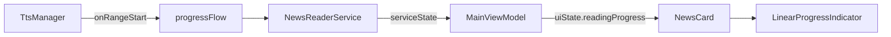

# 💡 BRIEF: TTS Reading Progress Bar

**Ngày tạo:** 2026-01-20
**Brainstorm cùng:** User

---

## 1. VẤN ĐỀ CẦN GIẢI QUYẾT

Khi TTS đang đọc tin tức, người dùng không biết:
- Đang đọc tới phần nào trong bài
- Còn bao lâu nữa mới đọc xong
- Tiến trình chính xác theo từng từ

**Hiện tại:** Chỉ có text "🔊 Đang đọc..." và hiệu ứng viền nhấp nháy.

## 2. GIẢI PHÁP ĐỀ XUẤT

Thêm **Linear Progress Bar** trên mỗi NewsCard:
- Hiển thị tiến trình đọc **realtime, chính xác theo từng từ**
- **Thay thế** text "🔊 Đang đọc..." bằng progress bar
- Design **đơn giản, một màu**
- Hoạt động trên cả **Portrait và Landscape** mode

## 3. ĐỐI TƯỢNG SỬ DỤNG

- **Primary:** Người lái xe xem tin nhanh (cần biết tiến trình mà không phân tâm)
- **Secondary:** Người dùng thông thường nghe tin

## 4. NGHIÊN CỨU KỸ THUẬT

### Phương pháp triển khai:

| Phương pháp | Độ chính xác | Khả thi | Ghi chú |
|-------------|--------------|---------|---------|
| **onRangeStart (API 26+)** | ⭐⭐⭐⭐⭐ ~95% | ✅ Có | App minSdk=26, hỗ trợ đầy đủ |
| Ước tính theo thời gian | ⭐⭐⭐ ~70% | ✅ Có | Fallback nếu cần |
| Track từng ký tự | ⭐⭐⭐⭐ ~85% | ⚠️ Phức tạp | Không cần thiết |

### Cấu trúc code hiện tại:

- [TtsManager.kt](file:///c:/Users/Admin/Desktop/Test_code/RSS-Reader-main/app/src/main/java/com/skul9x/rssreader/tts/TtsManager.kt) - Xử lý TTS, có `UtteranceProgressListener`
- [NewsCard.kt](file:///c:/Users/Admin/Desktop/Test_code/RSS-Reader-main/app/src/main/java/com/skul9x/rssreader/ui/components/NewsCard.kt) - UI hiển thị tin, có slot cho "Đang đọc..."
- [MainViewModel.kt](file:///c:/Users/Admin/Desktop/Test_code/RSS-Reader-main/app/src/main/java/com/skul9x/rssreader/ui/main/MainViewModel.kt) - Quản lý state `readingNewsIndex`
- [NewsReaderService.kt](file:///c:/Users/Admin/Desktop/Test_code/RSS-Reader-main/app/src/main/java/com/skul9x/rssreader/service/NewsReaderService.kt) - Foreground service đọc tin

### Điểm cần lưu ý:

> [!IMPORTANT]
> **onRangeStart** callback cung cấp `start` (vị trí bắt đầu) và `end` (vị trí kết thúc) của từ đang được đọc trong text.
> Progress = `currentPosition / totalTextLength`

> [!WARNING]  
> TTS có thể **chunk text dài** (>3500 chars) thành nhiều phần. Cần tính toán progress cho từng chunk và tổng hợp lại.

## 5. TÍNH NĂNG

### 🚀 MVP (Bắt buộc có):

- [x] Thêm `onRangeStart` callback vào `TtsManager.kt`
- [ ] Expose `readingProgress: Float` (0.0 → 1.0) ra StateFlow
- [ ] Truyền progress xuống `NewsCard` component
- [ ] Thay text "🔊 Đang đọc..." bằng `LinearProgressIndicator`
- [ ] Hoạt động trên Portrait mode
- [ ] Hoạt động trên Landscape mode (MainScreen.kt)

### 🎁 Phase 2 (Làm sau):

- [ ] Hiển thị % hoàn thành bên cạnh progress bar
- [ ] Hiển thị thời gian còn lại ước tính
- [ ] Animation mượt khi progress thay đổi

### 💭 Backlog (Cân nhắc):

- [ ] Highlight từ đang đọc trong summary text (cao cấp hơn)

## 6. ƯỚC TÍNH SƠ BỘ

- **Độ phức tạp:** 🟡 Trung bình (cần chỉnh nhiều file nhưng logic không phức tạp)
- **Rủi ro:**
  - `onRangeStart` có thể không được gọi trên một số TTS engine của bên thứ 3
  - Cần xử lý trường hợp text bị chunk thành nhiều phần

## 7. DATA FLOW (Luồng dữ liệu)

## 8. BƯỚC TIẾP THEO

→ Anh review BRIEF này và xác nhận OK thì em sẽ chuyển sang `/plan` để lên thiết kế chi tiết.

**Lựa chọn:**
1. ✅ OK - Lên plan chi tiết
2. ✏️ Sửa - Em cần điều chỉnh phần nào
3. 💾 Lưu - Anh cần suy nghĩ thêm
