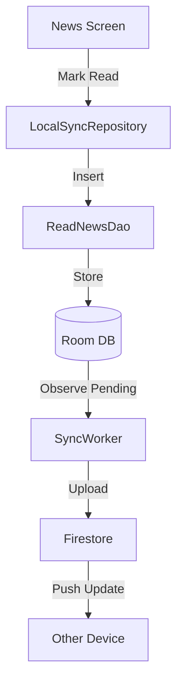

# System Architecture Overview

## Technology Stack

### Mobile (Android)
- **Language:** Kotlin
- **UI Framework:** Jetpack Compose (Material 3)
- **Architecture:** MVVM + Clean Architecture
- **Dependency Injection:** Hilt (Manual implementation currently)
- **Async:** Coroutines + Flow
- **Image Loading:** Coil
- **Local Storage:**
  - **Room:** Offline caching, Read history
  - **DataStore:** User preferences, Sync metadata

### Backend (Firebase)
- **Authentication:** Firebase Auth (Google Sign-In)
- **Database:** Cloud Firestore (NoSQL)
- **Storage:** None (Images loaded from source URL)

## Key Components

### 1. Data Layer
- **Repositories:** `NewsRepository`, `LocalSyncRepository`
- **Data Sources:**
  - `RssFeedDao`, `CachedNewsDao`, `ReadNewsDao` (Local)
  - `RssParser`, `GeminiApiClient` (Network)
  - `FirestoreSyncRepository` (Planned)

### 2. Domain/Service Layer
- **Services:** `NewsReaderService` (Process handling)
- **Managers:**
  - `AuthManager`: Authentication state
  - `TtsManager`: Text-to-Speech engine
  - `BatchQueueManager` (Planned): Sync queue

### 3. UI Layer
- **Screens:** `MainScreen`, `SettingsScreen`, `FeedsScreen`
- **ViewModels:** `MainViewModel`, `AuthViewModel`
- **Theme:** Dynamic color support

## Data Flow (Sync Feature)

