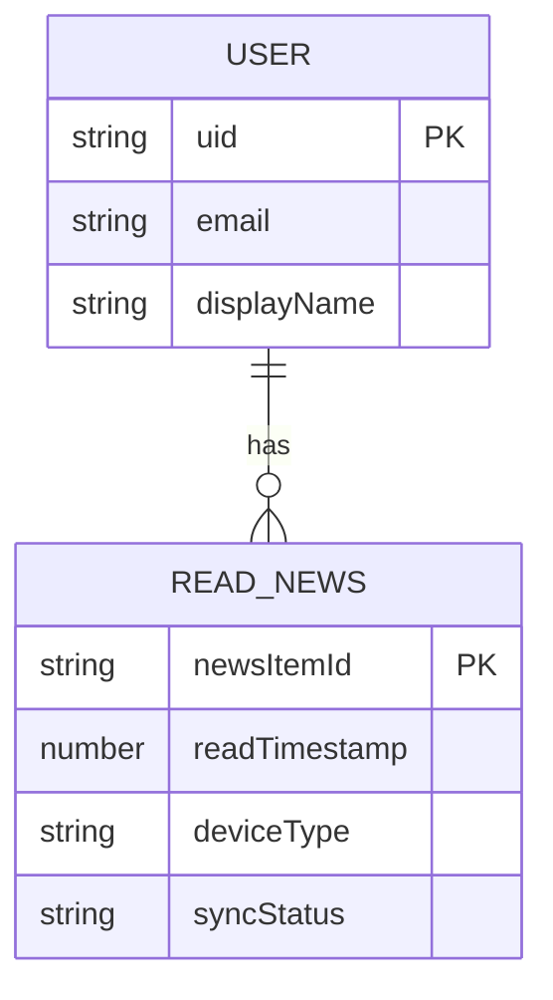
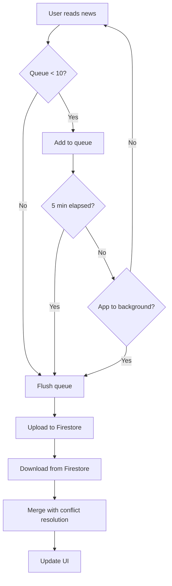

# Specification: Read Status Sync (Batch + Timer)

## 1. Executive Summary
Implement bi-directional synchronization of read news status between smartphone and Android box using Firebase Firestore. Sync occurs when user reads 10 items, OR after 5 minutes, OR when app goes to background.

**Business Value:** Users can seamlessly switch between devices without seeing duplicate content.

## 2. User Stories

### US-1: Cross-Device Sync
**As a** frequent RSS reader  
**I want** my read items to sync across my smartphone and car Android box  
**So that** I don't see duplicates when switching devices

**Acceptance Criteria:**
- Read item on device A → Item filtered on device B
- Sync happens within 5 minutes or immediately after 10 items
- Works offline (syncs when connection restored)

### US-2: Conflict Resolution
**As a** user with 2 active devices  
**I want** conflicts resolved automatically  
**So that** I don't have to manually manage read status

**Acceptance Criteria:**
- Same item read at same time → Smartphone timestamp wins
- Different timestamps → Earlier timestamp wins

## 3. Database Design

### 3.1 Local Database (Room)
```sql
CREATE TABLE read_news (
    newsItemId TEXT PRIMARY KEY,
    readTimestamp INTEGER NOT NULL,
    deviceType TEXT NOT NULL,
    syncStatus TEXT NOT NULL
);

CREATE INDEX idx_sync_status ON read_news(syncStatus);
CREATE INDEX idx_timestamp ON read_news(readTimestamp);
```

### 3.2 Remote Database (Firestore)
```
users/{userId}/readNews/{newsId}
  - newsItemId: string
  - readTimestamp: number
  - deviceType: string
  - updatedAt: timestamp
```

### 3.3 ERD


## 4. Logic Flowchart



## 5. API Contract

### 5.1 LocalSyncRepository
```kotlin
interface LocalSyncRepository {
    suspend fun markAsRead(newsId: String, deviceType: String)
    suspend fun isNewsRead(newsId: String): Boolean
    suspend fun getPendingItems(): List<ReadNewsEntity>
    suspend fun markAsSynced(newsIds: List<String>)
    suspend fun cleanupOldItems() // > 30 days
}
```

### 5.2 FirestoreSyncRepository
```kotlin
interface FirestoreSyncRepository {
    suspend fun uploadBatch(items: List<ReadNewsEntity>)
    suspend fun downloadAll(): List<ReadNewsEntity>
    suspend fun deleteOldItems(olderThan: Long)
    suspend fun mergeWithLocal(remote: List<ReadNewsEntity>, dao: ReadNewsDao)
}
```

### 5.3 BatchQueueManager
```kotlin
interface BatchQueueManager {
    suspend fun addToQueue(newsId: String, deviceType: String)
    suspend fun forceFlush()
    fun recoverPendingItems()
}
```

## 6. Scheduled Tasks

### Task 1: Periodic Sync (WorkManager)
- **Frequency:** Every 5 minutes (chained OneTimeWorkRequest)
- **Constraint:** Network connected
- **Action:** Call `BatchQueueManager.forceFlush()`
- **Retry:** 3 attempts with exponential backoff

### Task 2: Background Sync (Lifecycle)
- **Trigger:** `Lifecycle.Event.ON_STOP`
- **Action:** Call `BatchQueueManager.forceFlush()`

### Task 3: Cleanup (WorkManager)
- **Frequency:** Daily at 3 AM
- **Action:** Delete items > 30 days old (local + Firestore)

## 7. Third-party Integrations

### 7.1 Firebase Authentication
- **Purpose:** User identity for Firestore access control
- **Method:** Google Sign-In
- **SDK:** `firebase-auth-ktx:32.7.0`

### 7.2 Cloud Firestore
- **Purpose:** Remote sync storage
- **SDK:** `firebase-firestore-ktx:32.7.0`
- **Usage:** ~2 writes/day, ~20 reads/day per user

### 7.3 WorkManager
- **Purpose:** Background task scheduling
- **SDK:** `work-runtime-ktx:2.9.0`
- **Usage:** Periodic flush + cleanup

## 8. Hidden Requirements

### 8.1 Device Type Detection
```kotlin
fun getDeviceType(context: Context): String {
    val uiMode = context.resources.configuration.uiMode and Configuration.UI_MODE_TYPE_MASK
    return if (uiMode == Configuration.UI_MODE_TYPE_CAR) "androidbox" else "smartphone"
}
```

### 8.2 Crash Recovery
- All pending items persist in Room database
- On app restart, recover from `syncStatus = PENDING`
- WorkManager automatically reschedules

### 8.3 Conflict Resolution Priority
1. Earliest timestamp wins
2. If timestamps equal → Smartphone deviceType wins
3. Firestore `updatedAt` as tiebreaker (server timestamp)

### 8.4 Data Retention
- Auto-delete items > 30 days old
- Daily cleanup via WorkManager
- Applies to both local and Firestore

## 9. Tech Stack

| Component | Technology | Version |
|-----------|-----------|---------|
| Language | Kotlin | 1.9+ |
| UI | Jetpack Compose | 1.5+ |
| Local DB | Room | 2.6.1 |
| Preferences | DataStore | 1.0.0 |
| Auth | Firebase Auth | 32.7.0 |
| Remote DB | Firestore | 32.7.0 |
| Scheduler | WorkManager | 2.9.0 |
| Coroutines | Kotlin Coroutines | 1.7.3 |

## 10. Build Checklist

### Phase 01: Setup
- [ ] Create Firebase project
- [ ] Add `google-services.json`
- [ ] Configure dependencies
- [ ] Verify build success

### Phase 02: Authentication
- [ ] Implement Google Sign-In
- [ ] Create `AuthManager`
- [ ] Add sign-in UI to Settings
- [ ] Test sign-in/sign-out flow

### Phase 03: Local Database
- [ ] Create Room entities
- [ ] Implement DAO
- [ ] Create `LocalSyncRepository`
- [ ] Test CRUD operations

### Phase 04: Firestore Sync
- [ ] Design Firestore schema
- [ ] Configure security rules
- [ ] Implement `FirestoreSyncRepository`
- [ ] Test conflict resolution

### Phase 05: Batch Queue
- [ ] Create `BatchQueueManager`
- [ ] Implement thread-safe queue
- [ ] Test concurrent access
- [ ] Verify crash recovery

### Phase 06: Background Tasks
- [ ] Create `SyncWorker`
- [ ] Schedule periodic sync
- [ ] Add lifecycle observer
- [ ] Test background sync

### Phase 07: UI Integration
- [ ] Filter read items from feed
- [ ] Mark as read on scroll
- [ ] Test cross-device sync
- [ ] Verify conflict resolution

### Phase 08: Testing
- [ ] End-to-end device testing
- [ ] Performance testing
- [ ] Battery testing
- [ ] Production cleanup

## 11. Security Considerations

### 11.1 Firestore Rules
```javascript
rules_version = '2';
service cloud.firestore {
  match /databases/{database}/documents {
    match /users/{userId}/readNews/{newsId} {
      allow read, write: if request.auth != null && request.auth.uid == userId;
    }
  }
}
```

### 11.2 Data Privacy
- Users can only access their own read status
- No PII stored in Firestore (only news IDs)
- Sign-out clears local data (optional)

## 12. Performance Targets

| Metric | Target |
|--------|--------|
| Sync latency | < 2 seconds |
| UI filter time | < 100 ms |
| Batch upload | < 1 second (10 items) |
| Battery drain | < 5% per day |
| APK size increase | < 5 MB |

## 13. Edge Cases

| Case | Handling |
|------|----------|
| No internet | Queue persists, syncs when online |
| App crash | WorkManager recovers pending items |
| Sign-out | Keep local data, sync on re-login |
| Multiple devices | Conflict resolution applies |
| Large sync (1000+ items) | Chunked processing (50 items/chunk) |
| Firestore quota exceeded | Exponential backoff retry |

---

**Document Version:** 1.0  
**Created:** 2026-01-20  
**Author:** Antigravity AI
