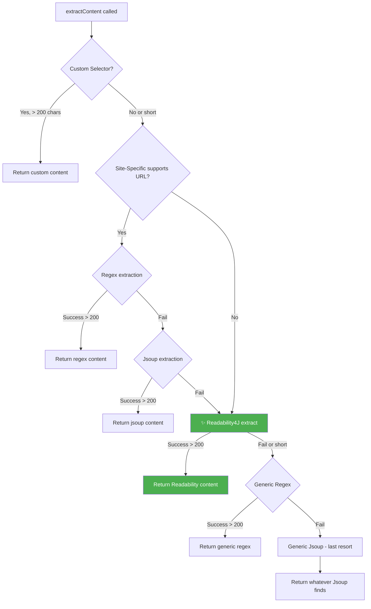

# Phase 03: Pipeline Integration
**Status:** ✅ Completed
**Dependencies:** Phase 02 (ReadabilityExtractor phải compile thành công)
**Ước tính:** ~30 phút

---

## Objective

Chèn `ReadabilityExtractor` vào `ContentExtractorRegistry` — file điều phối chính — ở đúng vị trí giữa Site-Specific Extractors và Generic Extractor.

## Kiến trúc hiện tại vs mới

### HIỆN TẠI (`ContentExtractorRegistry.extractContent()`):
```
1. Custom Selector (user-defined)     → return nếu > 200 chars
2. Site-Specific Extractor            → Regex → Jsoup → return nếu > 200 chars  
3. Generic Regex                      → return nếu > 200 chars
4. Generic Jsoup                      → return (last resort)
```

### SAU KHI SỬA:
```
1. Custom Selector (user-defined)     → return nếu > 200 chars      [GIỮA NGUYÊN]
2. Site-Specific Extractor            → Regex → Jsoup → return      [GIỮA NGUYÊN]
3. ✨ Readability4J                   → return nếu > 200 chars      [MỚI] 
4. Generic Regex                      → return nếu > 200 chars      [HẠ PRIORITY]
5. Generic Jsoup                      → return (last resort)        [HẠ PRIORITY]
```

## Requirements

### Functional
- [x] Readability4J được gọi SAU khi site-specific extractor thất bại
- [x] Readability4J được gọi TRƯỚC generic regex/jsoup
- [x] Nếu Readability4J trả content > 200 chars → return ngay, skip generic
- [x] Nếu Readability4J trả null hoặc < 200 chars → fallback xuống generic
- [x] Log rõ ràng để debug: "Readability4J success/failed, X chars"
- [x] Giữ nguyên 100% logic cũ cho trang đã có site-specific extractor

### Non-Functional
- [ ] Không thay đổi signature của `extractContent()` (backward compatible)
- [ ] Không thay đổi `ArticleContentFetcher` (facade vẫn gọi registry.extractContent())
- [ ] Performance: Readability4J parse ~50-200ms trên HTML trung bình → chấp nhận được

## Implementation Steps

### 1. Sửa `ContentExtractorRegistry.kt`

**Thay đổi 1:** Thêm field `readabilityExtractor`
```kotlin
class ContentExtractorRegistry(
    private val htmlCleaner: HtmlCleaner,
    private val logger: AppLogger,
    redirectResolver: RedirectResolver
) {
    // ... extractors list giữ nguyên ...
    
    private val genericExtractor = GenericExtractor(htmlCleaner)
    private val readabilityExtractor = ReadabilityExtractor(htmlCleaner) // ← THÊM
    // ...
}
```

**Thay đổi 2:** Chèn Readability4J vào giữa `extractContent()`

```kotlin
fun extractContent(doc: Document, html: String, url: String): String? {
    // 0. Custom Selector (GIỮA NGUYÊN) ...
    
    // 1. Site-Specific Extractor (GIỮA NGUYÊN) ...
    
    // 2. ✨ Readability4J (MỚI - chèn trước generic)
    val readabilityResult = readabilityExtractor.extract(html, url)
    if (readabilityResult != null && readabilityResult.length > 200) {
        logger.logJsoup(url, true, "Readability4J extraction success: ${readabilityResult.length} chars")
        return readabilityResult
    } else {
        logger.logJsoup(url, false, "Readability4J failed/short (${readabilityResult?.length ?: 0} chars), falling back to Generic")
    }
    
    // 3. Generic Regex (GIỮA NGUYÊN - hạ xuống fallback cuối) ...
    // 4. Generic Jsoup (GIỮA NGUYÊN - last resort) ...
}
```

### 2. Diff preview (so sánh trước/sau)

```diff
 fun extractContent(doc: Document, html: String, url: String): String? {
     // 0. Try Custom Selector (User Defined Override)
     // ... (giữ nguyên lines 48-65) ...
     
     // Find supporting extractor
     val extractor = extractors.find { it.supports(url) }
     
     if (extractor != null) {
         // ... (giữ nguyên lines 70-87) ...
     }
     
-    // 3. Phase 2 Fix: Fallback order changed - Try Regex before Jsoup for performance
+    // 3. ✨ Readability4J - Smart extraction for unknown sites
+    val readabilityResult = readabilityExtractor.extract(html, url)
+    if (readabilityResult != null && readabilityResult.length > 200) {
+        logger.logJsoup(url, true, "Readability4J extraction success: ${readabilityResult.length} chars")
+        return readabilityResult
+    } else {
+        logger.logJsoup(url, false, 
+            "Readability4J failed/short (${readabilityResult?.length ?: 0} chars), falling back to Generic")
+    }
+    
+    // 4. Generic Regex fallback (slower, less accurate)
     val genericRegex = genericExtractor.extractByRegex(html)
     if (genericRegex != null && genericRegex.length > 200) {
         logger.logJsoup(url, true, "Generic Regex extraction success")
         return genericRegex
     }
     
-    // Try generic Jsoup as last resort (slower but more reliable)
+    // 5. Generic Jsoup as absolute last resort
     return genericExtractor.extractByJsoup(doc, url)
 }
```

### 3. Thêm import

```kotlin
import com.skul9x.rssreader.data.network.extractors.ReadabilityExtractor
```

### 4. Xác nhận KHÔNG SỬA các file khác

| File | Thay đổi? | Lý do |
|------|-----------|-------|
| `ArticleContentFetcher.kt` | ❌ KHÔNG | Vẫn gọi `extractorRegistry.extractContent(doc, html, url)` — signature giữ nguyên |
| `GenericExtractor.kt` | ❌ KHÔNG | Vẫn hoạt động y hệt, chỉ bị gọi ít hơn (fallback cuối) |
| `SiteContentExtractor.kt` | ❌ KHÔNG | Interface giữ nguyên |
| Tất cả Site-Specific Extractors | ❌ KHÔNG | Ưu tiên cao nhất, vẫn được gọi trước |

## Files to Create/Modify

| File | Action | Mô tả |
|------|--------|-------|
| `ContentExtractorRegistry.kt` | **Sửa** | Thêm field + chèn logic Readability4J vào `extractContent()` |

## Kiểm tra trước khi qua Phase 04

- [x] `ContentExtractorRegistry.kt` compile thành công
- [x] Build debug thành công: `./gradlew assembleDebug`
- [x] Đọc log verify: Với URL VnExpress → vẫn dùng Site-Specific (không chạy Readability4J)
- [x] Đọc log verify: Với URL lạ → thử Readability4J trước, fallback Generic nếu thất bại
- [x] `ArticleContentFetcher.kt` không bị thay đổi

## Diagram: Execution Flow



## Notes

- **Performance concern:** Readability4J parse toàn bộ DOM tree → ~50-200ms. Nhưng đã chạy trong `Dispatchers.Default` (từ `ArticleContentFetcher.extractArticleFromDocument()`) nên không block UI.
- **Tại sao KHÔNG gọi Readability4J cho site-specific URLs?** Vì các extractors như VnExpress chính xác hơn (hiểu cấu trúc DOM cụ thể). Readability4J chỉ "đoán" → có thể lấy cả quảng cáo/sidebar.

---
**Previous Phase:** ← [Phase 02: ReadabilityExtractor Wrapper](./phase-02-readability-extractor.md)
**Next Phase:** → [Phase 04: Testing & Validation](./phase-04-testing-validation.md)
